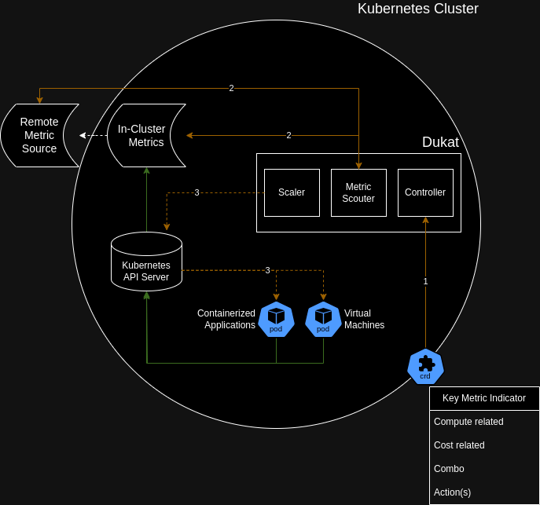

# Dukat

Dukat is an open source project providing a Kubernetes controller to enable a prepaid construct with:

* a voucher (Custom Resource) definition (1)
* with one or multiple dimensions (2)
    * cost value
    * time value 
    * quantifiable value (how many CPUs, storage, pods, namespaces, clusters, nodes, ...)
* controlling resources (3)
     * like a single Kubernetes object (storage, namespace, ...) 
     * like a set of Kubernetes objects grouped under a single or multiple namespace
     * like a Kubernetes cluster object (if using hypershift architecture)
* that entitles a tenant to schedule and scale the defined resources within the boundaries of the defined value

Once the voucher has been ingested, the controller will gate the scaling and scheduling with the following behaviors:  
* if related to cost or time, scaling down objects to zero or to a degraded state.
* if related to compute resources related, denying the scaling up or scheduling of more resources.

 